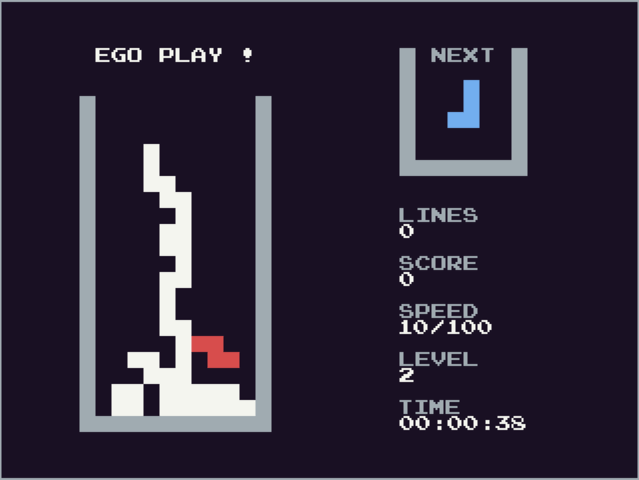

# Tetromino400




## A free and open source 80's interpretation of a famous overly copyrighted falling brick gameplay.

* Made with Python and Pygame on and for the Raspberry Pi 400.

I like the idea to have a library of open source games with a eigties feel for the RPI400 computer like if it was a computer coming from this long forgotten era where amiga, atari or amstrad was magical names.

I made the game from memory, so I am not sure I differ enough from the original gameplay, still it is not commercial product, it is remade for it's historical & educational value.


### Features :

* Ingame help & instructions.
* Two point types, the score will grow depending on the level and the speed points will grow until 100 to switch to next level. 
* Maybe around 16 colors, but mostly only 2, also with modern "Borrowed" sound and music.
* Play with the keyboard or with the gamepad.
* The scores are saved in a separate file (save.csv). Display the 8 best scores on the HIGHSCORES Board. The file is generated if file not found or corrupted.
* The game is over when 100 speed point at last level (9) are reached. Max time before game over is 1 hour, 1 minute & 1 seconde, but probably impossible to reach.
* Use "F" to swith into fullscreen mode. (I haven't kept fullscreen by default, there is some trouble right now around fullscreen mode on Ubuntu based linux distribution, maybe you will need to compile pygame on those platform to get it working.)


### Contribute :

It was more of a motivation project where the goal was to complete a full game with Python before to tackle my bigger projects, but if you want to add features or improve it, don't hesitate. 

Also I need help to make it safely FLOSS compatible as possible, I used sounds from sound-resource.com but it is probably free like free speech, more like free beer. If you have an idea how to replace it with better sound, you can submit a pull request I would be grateful. 

* [The open font source url, SIL licence](http://www.zone38.net/font/)
* [The sound source url](https://www.sounds-resource.com/pc_computer/tetriszone/sound/586/)
* [The music is creative commons](https://freesound.org/people/deleted_user_4397472/sounds/529737/)


### Releases :

* On github as code, on Pypi as package or on itchio as a build for the Raspberry Pi 400.


### Install the game :

```
pip install Tetromino400
```
* **pip3** if pip is used by python 2


### Dependencies :

It should work fine with a python 3.7+ version, but be careful as it requires the recent pygame 2 release (will crash with 1.9 versions).
Probably necessary a lot of SDL libraries to install.


### Start the game :


In the root directory :

```
python game.py
```
* **python3** on linux, if python is the version 2


### Future : 

* I started working on the side on an algorithm that I called "island shifting" to add to the game. The idea that sometimes when you accomplish there line a floating block could form. The algorithm would detect that and make this block fall to fill the empty spaces under it. I moved on something else now but I still could add it in the future to improve the gameplay.
