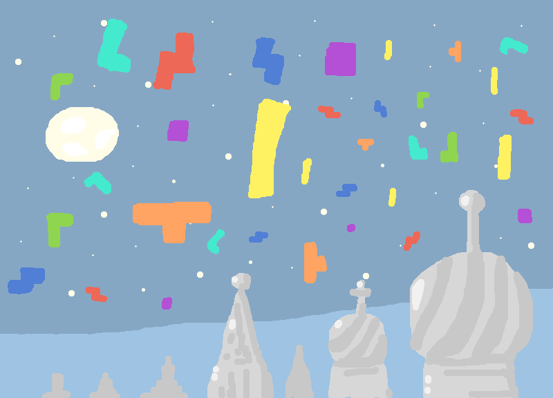
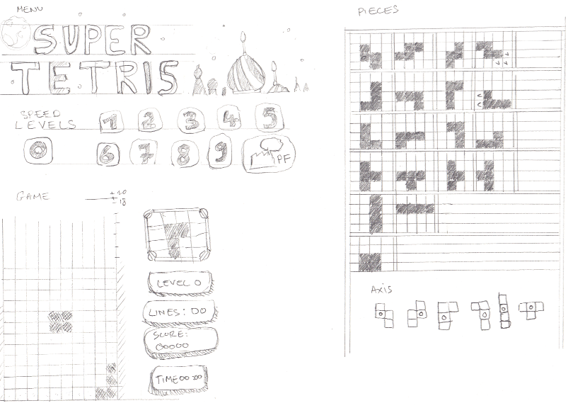
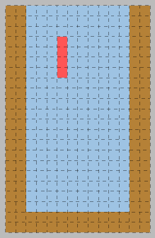

# Superpowers Game Development Series #6 
## **Super Tetris Game Devlog**

### **31/05/2016**

I am starting today the development of a Tetris clone, my inspiration come from the [gameboy/nes](https://en.wikipedia.org/wiki/Tetris) version mostly.

We can choose the speed level we start, every ten lines, the level go up, to finish the game from level 0, 100 lines must be done. I plan to do some classic sound for the brick and remake the best I can the famous Korobeïniki russian song.

I have vaguely an idea about a grid system that could work fine with this game, I need to make differents tests to be sure how all will work together, lot of bugs ahead I imagine.

I did draw on paper all the assets and screens I will need for the game, it give me an overall reference that I will use as I develop the game.

I find out than it is good habit to keep somewhere of drawing/concept art and/or technical/design document which are very helpful when we spend a lot of time later on little details. 

At some point we are so focused on them than it is good to have the opportunity to step back and see globally what we are doing globally.

I wish to finish the game + tutorial, in one month. We will see how it is going.

I also started to play a bit with superpowers, nothing fancy, I just set the stage to start the dev.

